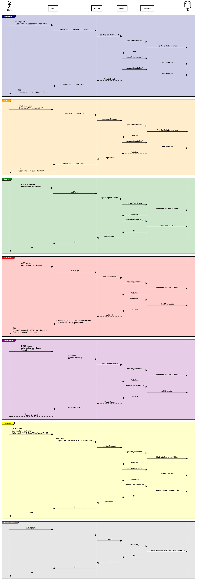

# Notes

Here are my notes :)

## GitHub Commands

1. Stage all modified files
   ```git add .```
2. Commit changes
   ```git commit -m "message here"```
3. Push changes
   ```git push```


## Chess UML Sequence Diagram




## Phase 3 Notes

Inside of server/src/main/java/Main.java in the main method, create a Server object, and then call run on it. The run method needs the port you will run your server on, which typically for testing is 8080. When you run the main method it will start the server. Intelij will give you several lines of red text, but if the last line says 'started' then the server is active.

### Implementation order
1. [x] Set up your starter code so that your server runs properly, and make sure the testing webpage loads.
2. [x] Use your sequence diagrams and the class diagram at the top of this page to guide the decision for what classes you might need.
   - Data Model Classes:
     - UserData
     - GameData
     - AuthData
   - Data Access Classes:
     - UserDAO
       - Methods: clear(), getUser(username), createUser(userData)
     - GameDAO
       - Methods: clear(), getGame(gameID), createGame(gameData), listGames(), updateGame(gameData)
     - AuthDAO
       - Methods: clear(), getAuth(authToken), createAuth(authData), deleteAuth(authToken)
   - Service Classes:
     - ClearService
       - Covers: clear()
     - GameService
       - Covers: create(), join(), list()
     - UserService
       - Covers: register(), login(), logout()
   - Serialization
   - Server Handler Classes
     - RegisterHandler
       - Connects with UserService
     - LoginHandler
       - Connects with UserService
     - LogoutHandler
       - Connects with UserService
     - CreateHandler
       - Connects with GameService
     - JoinHandler
       - Connects with GameService
     - ListHandler
       - Connects with GameService
     - ClearHandler
       - Connects with ClearService
3. [x] Create packages for where these classes will go, if you haven't already done so.
4. [x] Pick one Web API endpoint and get it working end-to-end. We recommend starting with clear or register.
   1. [x] Create the classes you need to implement the endpoint.
   1. [x] Write a service test or two to make sure the service and data access parts of your code are working as you expect.
   1. [x] Make sure you can hit your endpoint from the test page on a browser or Curl. Verify the response is what you expect it to be.
5. [x] Repeat this process for all other endpoints.
6. [x] Write a positive and a negative JUNIT test case for each public method on your Service classes, except for Clear which only needs a positive test case.


Data Model Classes:

- UserData
- GameData
- AuthData

! ended at request and result classes!
! still need to store passwords not in plain text!
! change argument exceptions to be better
! need to verify gameService is working
! add some comments to ResponseException
! what?: [!TIP] You are not required to create your handlers in their own distinct classes. You may implement this functionality directly in the lambda functions for the endpoints of your server.

Tested endpoints:
Clear
```ssh
curl -X DELETE http://localhost:8080/db
```
- working!

Register
```ssh
curl -X POST http://localhost:8080/user \
     -H "Content-Type: application/json" \
     -d '{
          "username": "testUser",
          "password": "password123",
          "email": "test@example.com"
         }'
```
- working!

Login
```ssh
curl -X POST http://localhost:8080/session \
     -H "Content-Type: application/json" \
     -d '{
          "username": "testUser",
          "password": "password123"
         }'
```
- working!

Logout
```ssh
curl -X DELETE http://localhost:8080/session \
     -H "authorization":"87f0b00e-eb74-42b1-8c6f-8a7f33aa871e"
```
- working!

List Games
```ssh
curl -X GET http://localhost:8080/game \
    -H "authorization":"672ae05d-d9e5-4d6e-9611-673ef1fc3b39"
```
- working!

Create Game
```ssh
curl -X POST http://localhost:8080/game \
    -H "authorization":"87f0b00e-eb74-42b1-8c6f-8a7f33aa871e" \
    -H "Content-Type: application/json" \
    -d '{"gameName": "new game"}'
```
- working!

Join Game
```ssh
curl -X PUT http://localhost:8080/game \
    -H "authorization":"672ae05d-d9e5-4d6e-9611-673ef1fc3b39" \
    -H "Content-Type: application/json" \
    -d '{"playerColor":"WHITE", "gameID": 2 }'
```


2nd user register
```ssh
curl -X POST http://localhost:8080/user \     
     -H "Content-Type: application/json" \                     
     -d '{                               
          "username": "testUser2",
          "password": "password123",
          "email": "test2@example.com"
         }'
```


## Phase 4 Notes
For mysql brew, to start run `brew services start mysql`

To verify its running run `brew services list`

To stop it run `brew services stop mysql`

To restart it run `brew services restart mysql`


1. [x] Install the MYSQL database management system (DBMS) on your development machine.
2. [x] Modify db.properties to contain your username and password.
3. [x] Design your database tables (i.e., your database schema)
4. [x] Implement a MySQL implementation of your Data Access Interface. Initially you can just stub out all the methods.
5. [x] Add the ability to create your database and tables, if they don't exist, when your server starts up.
6. [x] Iteratively write a test for each of your Data Access interface methods along with the backing MySQL code.
7. [x] Ensure that all provided pass off tests work properly, including the DatabaseTests added for this assignment, and the StandardAPITests from the previous assignment.

* Go back and add more test cases for sql stuff?


## Phase 5 Notes
- `client/src/main/java/ui` is where client app code goes
- `EscapeSequcnes.java` defines values you use to control the color of the console's output
- `client/src/test/java/client` is where client unit tests go.


## Phase 6 Notes
- `shared/src/main/java/websocket/` files `UserGameCommand.java` and `ServerMessage.java` are superclasses for websocket message classes


## Chess Application Structure

```
.
├── client/
│   └── src/main/java/
│       ├── ui/
│       │   ├── ChessClient.java
│       │   ├── EscapeSequences.java
│       │   ├── GameplayUI.java
│       │   ├── PostLoginUI.java
│       │   ├── PreLoginUI.java
│       │   └── Repl.java
│       └── Main.java
├── server/
│   └── src/main/java/
│   │   ├── dataaccess/
│   │   │   ├── memory/
│   │   │   │   ├── MemoryAuthDAO.java
│   │   │   │   ├── MemoryGameDAO.java
│   │   │   │   └── MemoryUserDAO.java
│   │   │   ├── sql/
│   │   │   │   ├── DatabaseManager.java
│   │   │   │   ├── SQLAuthDAO.java
│   │   │   │   ├── SQLGameDAO.java
│   │   │   │   └── SQLUserDAO.java
│   │   │   ├── AuthDAO.java
│   │   │   ├── DataAccessException.java
│   │   │   ├── GameDAO.java
│   │   │   └── UserDAO.java
│   │   ├── server/
│   │   │   └── Server.java
│   │   ├── service/
│   │   │   ├── ClearService.java
│   │   │   ├── GameService.java
│   │   │   ├── UserService.java
│   │   │   └── DatabaseUnavailableException.java
│   │   └── Main.java
│   └── resources/
│       ├── web/
│       │   ├── favicon.ico
│       │   ├── index.css
│       │   ├── index.html
│       │   └── index.js
│       └── db.properties
└── shared/
    └── src/main/java/
        ├── chess/
        │   ├── piece/
        │   │   ├── BishopMovesCalculator.java
        │   │   ├── KingMovesCalculator.java
        │   │   ├── KnightMovesCalculator.java
        │   │   ├── PawnMovesCalculator.java
        │   │   ├── QueenMovesCalculator.java
        │   │   ├── RookMovesCalculator.java
        │   │   ├── PieceMovesCalculator.java
        │   │   ├── SingleStepMovesCalculator.java
        │   │   └── SlidingMovesCalculator.java
        │   ├── ChessBoard.java
        │   ├── ChessGame.java
        │   ├── ChessMove.java
        │   ├── ChessPiece.java
        │   ├── ChessPosition.java
        │   └── InvalidMoveException.java
        ├── model/
        │   ├── AuthData.java
        │   ├── GameData.java
        │   ├── GameDetails.java
        │   ├── JoinRequest.java
        │   ├── ResponseException.java
        │   └── UserData.java
        ├── server/
        │   └── ServerFacade.java
        └── websocket/
            ├── commands/
            │   └── UserGameCommand.java
            └── messages/
                └── ServerMessage.java
```

# References: 

## Phase 3:

https://www.uuidgenerator.net/dev-corner/java

https://www.w3schools.com/java/java_hashmap.asp

## Phase 4:

https://www.w3schools.com/sql/sql_ref_drop_table.asp

https://www.w3schools.com/sql/sql_ref_keywords.asp

## Phase 6:

https://www.w3schools.com/java/java_user_input.asp
