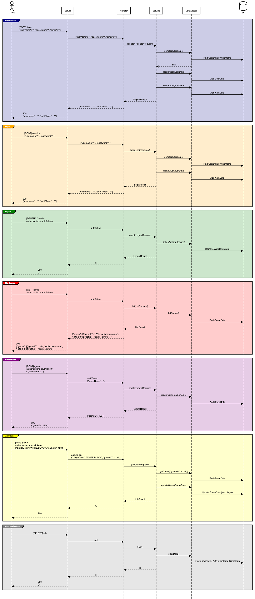

# Notes

Here are my notes :)

## GitHub Commands

1. Stage all modified files
   ```git add .```
2. Commit changes
   ```git commit -m "message here"```
3. Push changes
   ```git push```


## Chess UML Sequence Diagram



